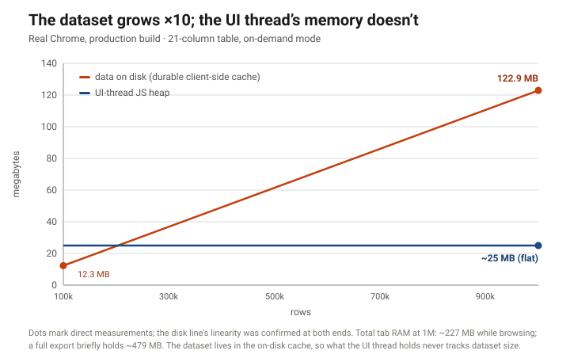

# Million-row datasets, in the browser, instantly usable

*How we made large-dataset editing GUIs viable on the web — no desktop install, no per-page waiting.*

**Date:** 2026-07-11 · **Basis:** measured, production builds — renderer and evidence class stated inline · **Infrastructure cost:** $0 — the data layer runs entirely client-side

## The problem

Agentic AI tools increasingly need to *show and edit* large structured datasets — power-system models, financial ledgers, scientific tables — with hundreds of thousands to millions of rows and tens to hundreds of columns. The conventional wisdom is that this forces a heavyweight desktop application: the browser "can't handle it."

It mostly can't — *if you build it the obvious way.* A normalized database behind an API that recompiles the view on every page render produces a GUI that is unusable at scale. In a production deployment of that pattern we observed firsthand, editing a ~100k-row table meant **a minute or more of wait per page**, climbing to **tens of minutes by ~500k rows** — re-computed on every interaction, every time. That experience is what convinces teams the web is a dead end for big data.

It isn't. The *architecture* is the dead end.

## What we built

A **client-side data layer** for large-dataset web GUIs. The shape, at the architecture level:

- Interaction is **instant end-to-end** — scroll, select, and move anywhere in the dataset with no per-page loading; a full-table export runs as a single fast operation, not a paged crawl.
- The full dataset is backed by a **durable client-side cache**, so any view is served on demand without a round trip.
- **Sorting and filtering stay smooth at scale** — served by the data layer, off the UI thread, where naive in-page data paths fall over.

Two complementary modes compose into one layer: a **resident mode** that holds the active table in memory for instant whole-dataset interaction, and an **on-demand mode** that serves views out of the durable cache with a near-constant UI memory footprint. Each covers the region where the other thins out. And the data layer is built around a storage-adapter contract, so a browser, a browser with persistent local storage, and a desktop shell are adapter swaps rather than rewrites — the web build isn't a compromise, it's the default.

## Results (measured, production builds)

Time from clicking a tab to the **whole dataset being usable** — scrollable to the last row, selectable, exportable:

| dataset | naive production stack | our data layer |
|---|---|---|
| ~100k rows | **minutes per page** | **~0.2 seconds** |
| ~500k rows | **tens of minutes** | **well under a second** |
| 1,000,000 rows | (effectively unusable) | **0.9–2.1 seconds** |
| 1,000,000 rows × **108 columns** (very wide) | — | **~2.8 seconds** |

**[Evidence class: resident mode on a 21-column table, measured on two renderers. A desktop-shell (embedded-Chromium) build sweeps linearly from 0.11 s at 100k to 0.89 s at 1M; standalone Chrome read 0.24 s at 100k and 2.14 s at 1M. The table quotes values covering both: ~0.2 s at 100k, 0.9–2.1 s at 1M. The 1M×108 figure (~2.8 s) is the desktop-shell build, uncorroborated at that width. 20–30% run-to-run variance is normal at this scale. The naive-stack column is banded from a real deployment; see Provenance.]**

Two more results that matter for real tools:

- **First screen in ~15 milliseconds.** The on-demand mode serves the first visible window in ~9–23 ms regardless of dataset size *or width*, so the UI is responsive immediately. **[measured across all sizes at both 21 and 108 columns]**
- **Many large tables open at once.** A realistic multi-table workload — several large tables plus many smaller ones — stays **comfortably within a single browser tab's memory budget, with room to spare**. **[measured; exact sizes deliberately banded]** The dataset sizes that supposedly force a desktop app fit on the web.

### The scaling picture



Grow the dataset ×10 and the on-demand mode's UI-thread heap doesn't move: the data lives in the durable cache, and the UI only ever holds the window you're looking at. **[Disk measured clean at 100k and 1M with linearity confirmed between them; steady-state heap measured at 1M; spot-measurements from separate sessions at 1k–100k sit in the same ~13–29 MB band. The flat line is the UI thread's heap — the whole tab sits near ~227 MB at 1M while browsing.]**

## Honest boundaries

- **The numbers are workstation-anchored.** Everything above was measured on a high-end workstation-class machine. Browser runtime environment matters as much as hardware: we measured the same cache-fill operation ~50× slower under a constrained headless preview runtime. The architecture holds on modest machines; the specific milliseconds don't travel — which is exactly what the forthcoming live demo is for: measure it on your own hardware.
- **The two modes trade differently — we don't blur them.** The headline table is the resident mode: fastest to whole-dataset-usable, but its memory grows with the data (roughly half a GB at 1M×21 columns, ~1.7 GB at 1M×108), it meets the browser's per-tab memory wall at a few million rows, and its in-memory sort is the conventional kind — fine at moderate scale, but it's the data-layer-routed path that stays smooth past it. The flat ~25 MB line is the on-demand mode: near-constant UI memory at any scale, in exchange for a one-time cache fill (~15 s at 1M rows on our box — it runs in the background behind the resident paint when the modes are composed; only a cold, on-demand-only first load makes you wait on it) and a first-sort cost on a fresh column (~1.6 s at 1M; repeats are ~10 ms).
- **Extreme width flips the winner.** At 1M rows × 108 columns the resident mode is the one that carries the load; the on-demand mode's full-width bulk ingest is what gives out first at that width. The composition is the point — each mode covers the region where the other thins out.
- **Run-to-run variance is real.** 20–30% between identical runs is normal at this scale, and one renderer family ran the 1M operation ~2.4× slower than another. We publish the clean canonical runs and say so.

## Why it matters

- **No install.** The capability that used to require a desktop application now runs in a tab — which is exactly what agentic AI tools need: zero-friction, shareable, sandboxed.
- **It composes.** Resident-active-data and an on-demand backbone aren't competing choices — they compose into one layer that is fast to first paint *and* holds everything when you need it.
- **It's portable by design.** The storage-adapter contract makes the desktop build an adapter swap, not a rewrite — browser today, desktop next, same data layer.

A live, public demo of this data layer is up at **[grid.aesresearch.ai](https://grid.aesresearch.ai/)** — a million rows you can scroll, sort, and edit in your own browser tab.

## What's next

The GUI and data layer are the substrate. The companion track replaces the heavy optimization engine behind these models with a learned **machine-learning surrogate** — keeping the data layer and the compute engine cleanly separated so the swap is a drop-in. That work is now published: [When does ML actually help LP dispatch?](when-does-ml-help-lp-dispatch.html)

## Provenance

Every number above traces to a measured artifact from two benchmark rounds (2026-06-24 and 2026-06-25) run in real browsers against production builds, plus a clean re-test that superseded two earlier figures — the superseded values are not used here. The headline table is a single clean sweep on one renderer, corroborated (with the stated spread) on a second; the scaling figure's disk line is measured at both endpoints with linearity confirmed; the multi-table result is a single measured configuration, banded deliberately. The naive-baseline column is a firsthand observation of a real third-party production deployment of the normalized-DB→API→GUI pattern, reported as bands and unattributed by design. The dataset is a synthetic power-system network table generated against an open schema — no proprietary data anywhere in the pipeline.

---

*Licensed [CC BY-SA 4.0](https://creativecommons.org/licenses/by-sa/4.0/).*

### Cite this essay

> Higuera, D. (2026, July 11). *Million-row datasets, in the browser, instantly usable*. AES Research. https://aesresearch.ai/writing/million-rows-in-the-browser.html

```bibtex
@misc{higuera2026millionrows,
  author = {Higuera, Daniel},
  title = {Million-row datasets, in the browser, instantly usable},
  year = {2026},
  month = {jul},
  publisher = {AES Research},
  url = {https://aesresearch.ai/writing/million-rows-in-the-browser.html}
}
```
